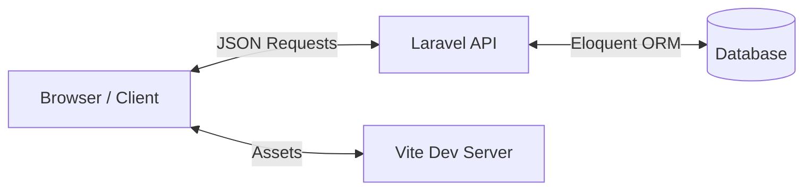

# 📋 Informe Técnico: SerraInnova

**Fecha**: 13 de Febrero de 2026
**Versión del Documento**: 1.0
**Estado**: Entregado

---

## 1. Introducción y Propósito

**SerraInnova** es una plataforma inmobiliaria moderna diseñada específicamente para el mercado de propiedades sostenibles y energéticamente eficientes. Este informe detalla la arquitectura técnica, las decisiones de diseño y la estructura del código que soporta la aplicación.

El objetivo principal del sistema es facilitar la búsqueda, gestión y promoción de viviendas con certificaciones energéticas altas (A-C), integrando herramientas de concienciación como una calculadora de huella de carbono y un blog educativo.

---

## 2. Arquitectura del Sistema

El proyecto sigue una arquitectura **Monorepo Híbrida** con separación lógica entre Cliente y Servidor, pero alojados en el mismo repositorio para facilitar el desarrollo.

### Modelo de Arquitectura: SPA (Single Page Application)

- **Frontend**: Actúa como una aplicación de página única (SPA) construida con Vue.js. Consume datos a través de una API RESTful.
- **Backend**: Laravel sirve como una API pura, manejando la lógica de negocio, la persistencia de datos y la autenticación. No renderiza vistas HTML tradicionales (Blade), sino que devuelve respuestas JSON.
- **Comunicación**: Intercambio de datos asíncrono vía HTTP/JSON.

---

## 3. Stack Tecnológico

El proyecto utiliza las últimas versiones estables de las tecnologías seleccionadas para garantizar longevidad y rendimiento.

| Componente        | Tecnología     | Versión | Propósito                                          |
| :---------------- | :------------- | :------ | :------------------------------------------------- |
| **Backend**       | Laravel        | 12.0    | Framework PHP para la API REST.                    |
| **Lenguaje**      | PHP            | 8.2+    | Lenguaje base del servidor.                        |
| **Frontend**      | Vue.js         | 3.5     | Framework reactivo para la UI.                     |
| **Estado**        | Pinia          | 2.1     | Gestión de estado global (Store).                  |
| **Estilos**       | TailwindCSS    | 4.0     | Framework CSS utility-first.                       |
| **Build Tool**    | Vite           | 7.0     | Empaquetador y servidor de desarrollo.             |
| **Router**        | Vue Router     | 4.x     | Enrutamiento del lado del cliente.                 |
| **Base de Datos** | SQLite / MySQL | -       | Persistencia de datos (SQLite por defecto en dev). |

---

## 4. Estructura del Backend (API)

El backend está estructurado siguiendo el patrón MVC, aunque estrictamente actúa como una arquitectura de API (Controladores y Modelos).

### 4.1. Modelos de Datos (`App\Models`)

Los modelos principales que rigen la lógica de negocio son:

1.  **User**: Gestión de autenticación y roles de administrador.
2.  **Property**: El núcleo del sistema. Almacena información detallada de las viviendas (precio, ubicación, certificación energética, características sostenibles).
3.  **BlogPost**: Artículos educativos sobre sostenibilidad. Soporta slugs para URLs amigables SEO.
4.  **Contact**: Almacena los mensajes recibidos a través del formulario de contacto para su posterior gestión en el panel de administración.

### 4.2. Controladores API (`App\Http\Controllers\Api`)

La lógica se distribuye en controladores dedicados:

- **PropertyController**:
    - `index()`: Listado paginado con filtros.
    - `featured()`: Retorna propiedades destacadas para la home.
    - `show($id)`: Detalle de una propiedad específica.
    - Métodos `store`, `update`, `destroy` para administración.

- **BlogController**:
    - Maneja la recuperación de artículos, filtrado por categorías y gestión CRUD para el panel de administración.

- **ContactController**:
    - Recibe envíos de formularios (`store`).
    - Permite a los administradores ver mensajes y cambiar su estado (`updateStatus`).

### 4.3. Rutas (`routes/api.php`)

Las rutas están organizadas en dos grupos:

1.  **Públicas**: Accesibles sin autenticación (Ver propiedades, leer blog, enviar contacto).
2.  **Admin (`/admin`)**: Rutas protegidas para gestión de contenido (CRUD de propiedades y blog, gestión de mensajes).

---

## 5. Estructura del Frontend (Vue.js)

El frontend reside en `resources/js` y es el punto de entrada de la aplicación.

### 5.1. Organización de Directorios

- **components/**: Componentes de UI reutilizables (Botones, Tarjetas de Propiedad, Inputs, Modales).
- **views/**: Vistas principales que corresponden a las rutas (Home, Propiedades, Blog, AdminDashboard).
- **stores/**: Stores de Pinia para manejar el estado global (ej. `usePropertyStore`, `useAuthStore`).
- **router.js**: Definición de las rutas de navegación del cliente.

### 5.2. Integración con TailwindCSS

Se utiliza **Tailwind CSS v4**, configurado para escanear automáticamente los archivos `.vue` y `.js` en busca de clases. Esto elimina la necesidad de escribir CSS personalizado, reduciendo el tamaño del bundle final.

---

## 6. Base de Datos y Almacenamiento

### 6.1. Esquema de Datos (Inferido)

- **Tabla `properties`**:
    - `id`, `title`, `description`, `price`, `location`
    - `energy_rating` (A-G)
    - `emissions_co2`, `energy_consumption`
    - `features` (JSON o relación): Paneles solares, aislamiento, etc.
- **Tabla `blog_posts`**:
    - `id`, `title`, `slug`, `content`, `image_url`
    - `published_at`, `author_id`

### 6.2. Almacenamiento de Archivos

Las imágenes de propiedades y artículos del blog se almacenan en el disco `public` de Laravel (`storage/app/public`), accesibles vía enlace simbólico.

---

## 7. Requisitos de Despliegue

Para poner en producción la aplicación, el servidor debe cumplir con:

- **Servidor Web**: Nginx o Apache.
- **PHP**: Versión 8.2 con extensiones `bcmath`, `ctype`, `fileinfo`, `json`, `mbstring`, `openssl`, `pdo`, `tokenizer`, `xml`.
- **Base de Datos**: MySQL 8.0+ o PostgreSQL.
- **Node.js**: Necesario solo para el build step (`npm run build`).

---

## 8. Conclusiones y Recomendaciones

El sistema **SerraInnova** presenta una base sólida y moderna. La elección de Vue.js con Laravel es un estándar de la industria que ofrece un excelente equilibrio entre productividad y rendimiento.

**Recomendaciones futuras:**

1.  **Autenticación**: Implementar Laravel Sanctum o JWT para asegurar las rutas de administración en producción.
2.  **Testing**: Ampliar la cobertura de tests unitarios (PHPUnit) y añadir tests E2E (Cypress/Playwright) para el flujo crítico de contacto y búsqueda.
3.  **CI/CD**: Configurar GitHub Actions para automatizar el testing y despliegue.
