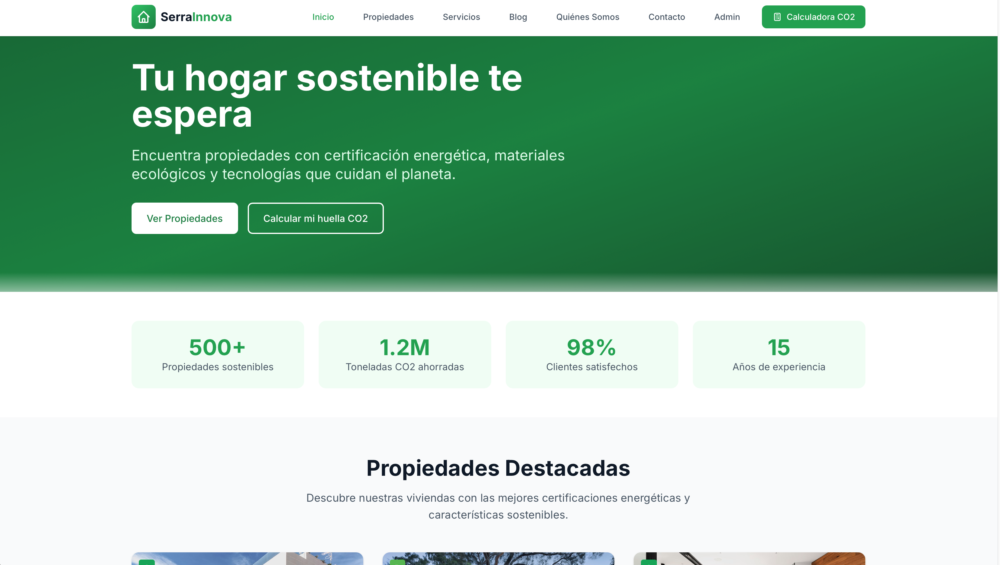
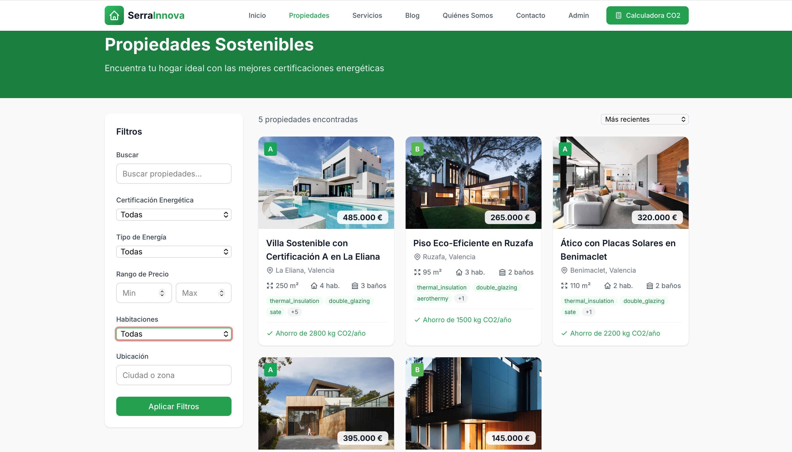
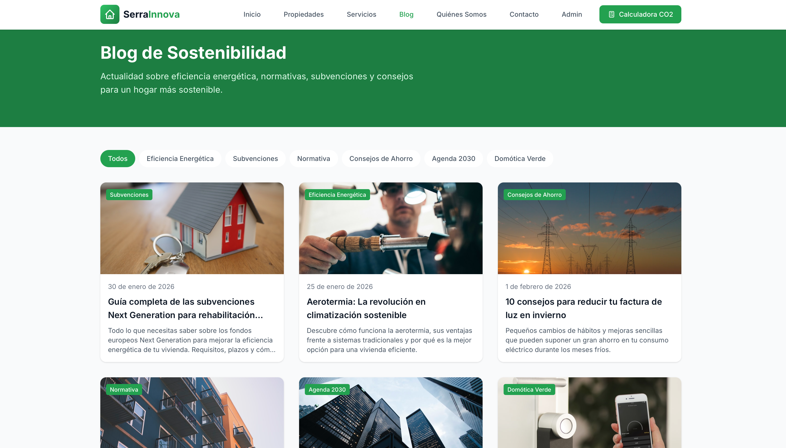
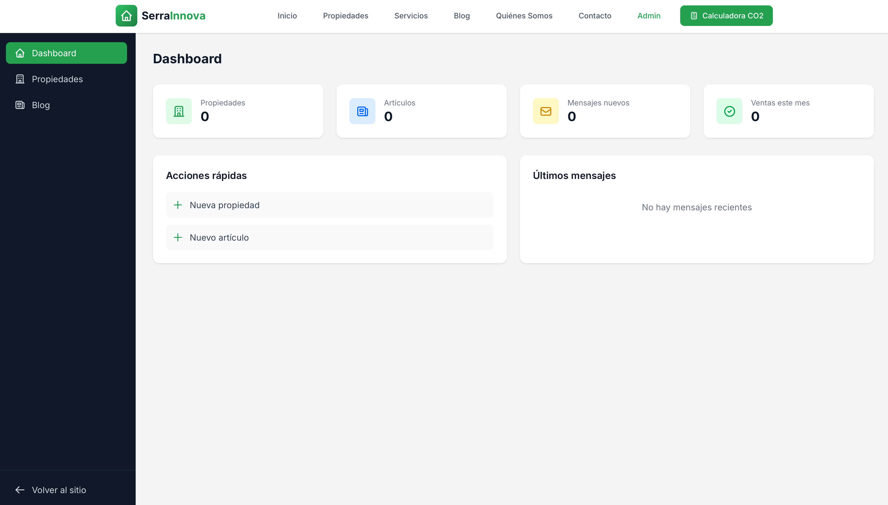
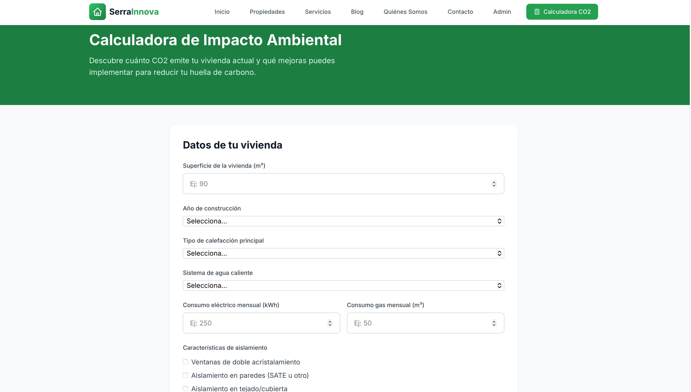

<div align="center">

# 🏡 SerraInnova

### Inmobiliaria Sostenible


<br>

[](https://laravel.com)
[](https://vuejs.org)
[](https://tailwindcss.com)
[](https://vitejs.dev)

**Plataforma inmobiliaria especializada en propiedades sostenibles y eficiencia energética**

[🌐 Demo](#instalación) · [🐛 Reportar Bug](https://github.com/fardatxo/ProyectoPiieGrupo3/issues) · [✨ Solicitar Feature](https://github.com/fardatxo/ProyectoPiieGrupo3/issues)

---

</div>

## 📸 Vista Previa

<div align="center">

### 🏠 Página Principal


*Hero section con estadísticas de impacto ambiental y propiedades destacadas*

---

### 🏘️ Catálogo de Propiedades


*Filtros avanzados por certificación energética, tipo de energía, precio y más*

---

### 📰 Blog de Sostenibilidad


*Artículos sobre eficiencia energética, subvenciones y consejos de ahorro*

---

### ⚙️ Panel de Administración


*Dashboard completo para gestionar propiedades, artículos y mensajes*

---

### 🧮 Calculadora CO2


*Calcula la huella de carbono de tu vivienda y descubre mejoras*

</div>

---

## ✨ Características

<table>
<tr>
<td width="50%" valign="top">

### 🌱 Propiedades Sostenibles
- ✅ Certificación energética (A-G)
- ✅ Filtros por tipo de energía
- ✅ Características de sostenibilidad
- ✅ Ahorro de CO2 calculado
- ✅ Múltiples certificaciones

</td>
<td width="50%" valign="top">

### 🔋 Eficiencia Energética
- ✅ Aerotermia y geotermia
- ✅ Paneles solares fotovoltaicos
- ✅ Aislamiento térmico SATE
- ✅ Domótica verde
- ✅ Recuperación de aguas

</td>
</tr>
<tr>
<td width="50%" valign="top">

### 📊 Panel de Administración
- ✅ Dashboard con estadísticas
- ✅ Gestión de propiedades CRUD
- ✅ Editor de blog integrado
- ✅ Gestión de contactos
- ✅ Subida de imágenes

</td>
<td width="50%" valign="top">

### 🧮 Calculadora CO2
- ✅ Calcula tu huella de carbono
- ✅ Compara con viviendas eficientes
- ✅ Recomendaciones personalizadas
- ✅ Ahorro estimado anual
- ✅ Mejoras sugeridas

</td>
</tr>
</table>

---

## 🚀 Instalación

### Requisitos Previos

| Requisito | Versión |
|-----------|---------|
| PHP | 8.2+ |
| Composer | 2.x |
| Node.js | 18+ |
| npm | 9+ |

### Pasos de Instalación

```bash
# 1️⃣ Clonar el repositorio
git clone https://github.com/fardatxo/ProyectoPiieGrupo3.git
cd ProyectoPiieGrupo3

# 2️⃣ Instalar dependencias PHP
composer install

# 3️⃣ Instalar dependencias JavaScript
npm install

# 4️⃣ Configurar entorno
cp .env.example .env
php artisan key:generate

# 5️⃣ Ejecutar migraciones y seeders
php artisan migrate --seed

# 6️⃣ Crear enlace de storage
php artisan storage:link

# 7️⃣ Compilar assets (desarrollo)
npm run dev

# 8️⃣ Iniciar servidor
php artisan serve
```

🎉 **¡Listo!** Visita `http://localhost:8000`

---

## 🏗️ Estructura del Proyecto

```
📦 SerraInnova
├── 📂 app
│   ├── 📂 Http/Controllers/Api    # Controladores REST API
│   └── 📂 Models                  # Modelos Eloquent
├── 📂 database
│   ├── 📂 migrations              # Migraciones de BD
│   └── 📂 seeders                 # Datos de ejemplo
├── 📂 resources
│   ├── 📂 js
│   │   ├── 📂 components          # Componentes Vue reutilizables
│   │   ├── 📂 views               # Páginas de la aplicación
│   │   ├── 📂 stores              # Pinia stores (estado)
│   │   └── 📄 router.js           # Configuración Vue Router
│   └── 📂 css                     # Estilos TailwindCSS
├── 📂 public
│   └── 📂 images                  # Imágenes estáticas
└── 📂 routes
    ├── 📄 api.php                 # Rutas API REST
    └── 📄 web.php                 # Rutas Web (SPA)
```

---

## 🛠️ Stack Tecnológico

<div align="center">

| Categoría | Tecnologías |
|:---------:|:-----------:|
| **Backend** |   |
| **Frontend** |   |
| **Estado** |  |
| **Build** |  |
| **Base de Datos** |   |

</div>

---

## 📱 Rutas de la Aplicación

### 🌐 Rutas Públicas

| Ruta | Descripción |
|:-----|:------------|
| `/` | 🏠 Página de inicio con propiedades destacadas |
| `/propiedades` | 🏘️ Catálogo completo con filtros avanzados |
| `/propiedades/:id` | 🏡 Detalle de propiedad individual |
| `/blog` | 📰 Listado de artículos del blog |
| `/blog/:slug` | 📝 Artículo completo |
| `/calculadora` | 🧮 Calculadora de huella CO2 |
| `/servicios` | 🛠️ Nuestros servicios |
| `/quienes-somos` | 👥 Sobre nosotros |
| `/contacto` | 📧 Formulario de contacto |

### 🔐 Rutas de Administración

| Ruta | Descripción |
|:-----|:------------|
| `/admin` | 📊 Dashboard principal |
| `/admin/propiedades` | 🏘️ Gestión de propiedades |
| `/admin/propiedades/crear` | ➕ Nueva propiedad |
| `/admin/propiedades/:id/editar` | ✏️ Editar propiedad |
| `/admin/blog` | 📰 Gestión del blog |
| `/admin/blog/crear` | ➕ Nuevo artículo |

---

## 🌿 Certificaciones Energéticas

<div align="center">

| Letra | Eficiencia | Consumo (kWh/m²/año) |
|:-----:|:-----------|:---------------------|
| 🟢 **A** | Muy eficiente | < 45 |
| 🟢 **B** | Eficiente | 45 - 75 |
| 🟡 **C** | Moderada | 75 - 100 |
| 🟡 **D** | Normal | 100 - 150 |
| 🟠 **E** | Baja | 150 - 230 |
| 🔴 **F** | Muy baja | 230 - 300 |
| 🔴 **G** | Mínima | > 300 |

</div>

### 🏆 Certificaciones Disponibles

<div align="center">


</div>

---

## 📡 API Endpoints

<details>
<summary><b>🏠 Propiedades</b></summary>

```http
GET    /api/properties              # Listar propiedades (paginado)
GET    /api/properties/featured     # Propiedades destacadas
GET    /api/properties/:id          # Detalle de propiedad
POST   /api/admin/properties        # Crear propiedad
POST   /api/admin/properties/:id    # Actualizar propiedad
DELETE /api/admin/properties/:id    # Eliminar propiedad
```
</details>

<details>
<summary><b>📰 Blog</b></summary>

```http
GET    /api/blog                    # Listar artículos (paginado)
GET    /api/blog/latest             # Últimos 3 artículos
GET    /api/blog/categories         # Categorías disponibles
GET    /api/blog/:slug              # Artículo por slug
POST   /api/admin/blog              # Crear artículo
POST   /api/admin/blog/:id          # Actualizar artículo
DELETE /api/admin/blog/:id          # Eliminar artículo
```
</details>

<details>
<summary><b>📧 Contacto</b></summary>

```http
POST   /api/contact                 # Enviar mensaje de contacto
GET    /api/admin/contacts          # Listar mensajes (admin)
GET    /api/admin/contacts/:id      # Ver mensaje
PATCH  /api/admin/contacts/:id/status # Actualizar estado
```
</details>

---

## 👥 Equipo

<div align="center">

| Desarrollador | GitHub |
|:-------------:|:------:|
| **Adri** | [](https://github.com/fardatxo) |
| **Gian** | [](https://github.com/GianCarlos25) |
| **Alberto** | [](https://github.com/alarmi04) |
| **Ismael** | [](https://github.com/pequemaquina-ctrl) |
| **Alex** | [](https://github.com/AVL05) |

</div>

---

## 🌍 Compromiso Sostenible

<div align="center">

Este proyecto contribuye a los **Objetivos de Desarrollo Sostenible**:

| ODS 7 | ODS 11 | ODS 13 |
|:-----:|:------:|:------:|
| ⚡ Energía asequible y no contaminante | 🏙️ Ciudades y comunidades sostenibles | 🌍 Acción por el clima |

</div>

---

## 📄 Licencia

Este proyecto está bajo la Licencia MIT. Ver el archivo [LICENSE](LICENSE) para más detalles.

---

<div align="center">

Hecho con 💚 por **Grupo 3 PIIE** para un futuro más sostenible

⭐ **¡Dale una estrella si te ha gustado!** ⭐

</div>
